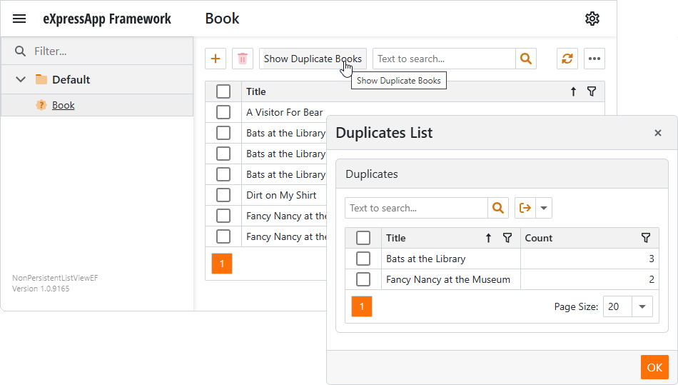

<!-- default badges list -->

[](https://supportcenter.devexpress.com/ticket/details/E980)
[](https://docs.devexpress.com/GeneralInformation/403183)
[](#does-this-example-address-your-development-requirementsobjectives)
<!-- default badges end -->
# How to: Display a List of Non-Persistent Objects via an Intermediate Container Class and Its DetailView  

This example stores a list of books. When a user clicks the **Show Duplicate Books** action, a popup dialog displays a list of duplicated books and their copy counts. This list is implemented as a [non-persistent object](https://docs.devexpress.com/eXpressAppFramework/116516/business-model-design-orm/non-persistent-objects)'s Detail View.

> **Note**:
> This example uses an intermediate container class to display a list non-persistent objects. In this case, the [ObjectsGetting](https://docs.devexpress.com/eXpressAppFramework/DevExpress.ExpressApp.NonPersistentObjectSpace.ObjectsGetting) method cannot be applied. If your application logic does not require complex operations to create non-persistent objects, use the [ObjectsGetting](https://docs.devexpress.com/eXpressAppFramework/DevExpress.ExpressApp.NonPersistentObjectSpace.ObjectsGetting) method. Refer to the following article for implementation details: [How to: Display a Non-Persistent Object's List View from the Navigation](https://docs.devexpress.com/eXpressAppFramework/114052/business-model-design-orm/non-persistent-objects/how-to-display-a-non-persistent-objects-list-view-from-the-navigation).



## Implementation Details

1. Declare the `Book` persistent class. Objects of this class represent books in a collection.

   File to review: [Book.cs](./CS/EFCore/NonPersistentListViewEF/NonPersistentListViewEF.Module/BusinessObjects/Book.cs) _(EFCore Solution_)
	
	```csharp
    [DefaultClassOptions]
    public class Book : BaseObject {
        public virtual string Title { get; set; }
    }
	```

    File to review: [Book.cs](./CS/XPO/NonPersistentListViewEF/NonPersistentListViewEF.Module/BusinessObjects/Book.cs) _(XPO Solution)_
	
	```csharp
    [DefaultClassOptions]
    public class Book :BaseObject {
        public Book(Session session) : base(session) { }
        public string Title {
            get { return GetPropertyValue<string>(nameof(Title)); }
            set { SetPropertyValue<string>(nameof(Title), value); }
        }
    }
	```

1. Declare two non-persistent classes—`Duplicate` and `DuplicatesList` and decorate them with the [DomainComponentAttribute](https://docs.devexpress.com/eXpressAppFramework/DevExpress.ExpressApp.DC.DomainComponentAttribute).

    - The `Duplicate` class includes two properties—`Title` and `Count`. A class instance stores a unique book title and the total number of books with this title (if there is more than one book).
    - The `DuplicatesList` class aggregates the `Duplicate` objects.

    _Files to review:_ [Duplicate.cs](./CS/EFCore/NonPersistentListViewEF/NonPersistentListViewEF.Module/BusinessObjects/Duplicate.cs) _(EFCore Solution)_ / [Duplicate.cs](./CS/XPO/NonPersistentListViewEF/NonPersistentListViewEF.Module/BusinessObjects/Duplicate.cs) _(XPO Solution)_
    
	```csharp
    [DomainComponent]
    public class Duplicate: NonPersistentBaseObject {
        public string Title { get; set; }
        public int Count { get; set; }
    }
    [DomainComponent]
    public class DuplicatesList: NonPersistentBaseObject {
        private BindingList<Duplicate> duplicates;
        public DuplicatesList() {
            duplicates = new BindingList<Duplicate>();
        }
        public BindingList<Duplicate> Duplicates { get { return duplicates; } }
    }
	```

	Note that to operate with non-persistent objects, the Non-Persistent Object Space Provider must be registered in the the application's _Startup.cs_ file.

	```csharp
	// ...
	builder.ObjectSpaceProviders
		// ...
		.AddNonPersistent();
	// ...
	```

1. Create the **ShowDuplicateBooksController** View Controller. In the controller, implement a method that iterates through persistent `Book` objects and counts the number of copies of each book. Store this information in a dictionary.

	```csharp
	// ...
	private Dictionary<string, int> GetDuplicatesDictionary() {
		var dictionary = new Dictionary<string, int>();
		foreach(Book book in View.CollectionSource.List) {
			if(string.IsNullOrWhiteSpace(book.Title)) continue;

			if(dictionary.TryGetValue(book.Title, out int count)) {
				dictionary[book.Title] = count + 1;
			} else {
				dictionary[book.Title] = 1;
			}
		}
		return dictionary;
	}
	// ...
	```

1. Implement a method that iterates through dictionary items and creates `Duplicate` objects for items with a value greater than one (books with more than one copy). Arrange `Duplicate` objects into a `DuplicatesList` object.

	```csharp
	// ...
	private DuplicatesList CreateDuplicatesList(Dictionary<string, int> duplicatesDictionary, IObjectSpace objectSpace) {
		DuplicatesList duplicatesList = objectSpace.CreateObject<DuplicatesList>();
		foreach(var (title, count) in duplicatesDictionary) {
			if(count <= 1) continue;

			var duplicate = objectSpace.CreateObject<Duplicate>();
			duplicate.Title = title;
			duplicate.Count = count;

			duplicatesList.Duplicates.Add(duplicate);
		}
		objectSpace.CommitChanges();
		return duplicatesList;
	}
	// ...
	```

1. Add the [PopupWindowShowAction](https://docs.devexpress.com/eXpressAppFramework/DevExpress.ExpressApp.Actions.PopupWindowShowAction) to display a popup dialog when a user clicks the **Show Duplicate Books** action. Handle the [CustomizePopupWindowParams](https://docs.devexpress.com/eXpressAppFramework/DevExpress.ExpressApp.Actions.PopupWindowShowAction.CustomizePopupWindowParams) event and call the [CreateDetailView](https://docs.devexpress.com/eXpressAppFramework/DevExpress.ExpressApp.XafApplication.CreateDetailView(DevExpress.ExpressApp.IObjectSpace-System.Object)) method to create a Detail View for the `DuplicatesList` object.

	```csharp
	// ...
	public ShowDuplicateBooksController() {
		PopupWindowShowAction showDuplicatesAction = new PopupWindowShowAction(this, "ShowDuplicateBooks", PredefinedCategory.View);
		showDuplicatesAction.CustomizePopupWindowParams += showDuplicatesAction_CustomizePopupWindowParams;
	}
	private void showDuplicatesAction_CustomizePopupWindowParams(object sender, CustomizePopupWindowParamsEventArgs e) {
		var duplicatesDictionary = GetDuplicatesDictionary();
		var nonPersistentObjectSpace = Application.CreateObjectSpace(typeof(DuplicatesList));
		var duplicatesList = CreateDuplicatesList(duplicatesDictionary, nonPersistentObjectSpace);
		e.View = Application.CreateDetailView(nonPersistentObjectSpace, duplicatesList);
		e.DialogController.SaveOnAccept = false;
		e.DialogController.CancelAction.Active["NothingToCancel"] = false;
	}
	// ...
	```

## Files to Review

- [Book.cs](./CS/EFCore/NonPersistentListViewEF/NonPersistentListViewEF.Module/BusinessObjects/Book.cs) (EFCore Solution) / [Book.cs](./CS/XPO/NonPersistentListView/NonPersistentListView.Module/BusinessObjects/Book.cs) (XPO Solution)
- [Duplicate.cs](./CS/EFCore/NonPersistentListViewEF/NonPersistentListViewEF.Module/BusinessObjects/Duplicate.cs) (EFCore Solution) / [Duplicate.cs](./CS/XPO/NonPersistentListView/NonPersistentListView.Module/BusinessObjects/Duplicate.cs) (XPO Solution)
- [ShowDuplicateBooksController.cs](./CS/EFCore/NonPersistentListViewEF/NonPersistentListViewEF.Module/Controllers/ShowDuplicateBooksController.cs) (EFCore Solution) / [ShowDuplicateBooksController.cs](./CS/XPO/NonPersistentListView/NonPersistentListView.Module/Controllers/ShowDuplicateBooksController.cs) (XPO Solution)

## Documentation

- [Non-Persistent Objects](https://docs.devexpress.com/eXpressAppFramework/116516/business-model-design-orm/non-persistent-objects)
- [How to: Display a List of Non-Persistent Objects via an Intermediate Container Class and Its DetailView](https://docs.devexpress.com/eXpressAppFramework/113167/business-model-design-orm/non-persistent-objects/how-to-display-a-list-of-non-persistent-objects-in-a-popup-dialog)

## More Examples

- [How to implement CRUD operations for Non-Persistent Objects stored remotely in eXpressApp Framework](https://github.com/DevExpress-Examples/XAF_Non-Persistent-Objects-Editing-Demo)
- [How to edit Non-Persistent Objects nested in a Persistent Object](https://github.com/DevExpress-Examples/XAF_Non-Persistent-Objects-Nested-In-Persistent-Objects-Demo)
- [How to filter and sort Non-Persistent Objects](https://github.com/DevExpress-Examples/XAF_Non-Persistent-Objects-Filtering-Demo)
- [How to refresh Non-Persistent Objects and reload nested Persistent Objects](https://github.com/DevExpress-Examples/XAF_Non-Persistent-Objects-Reloading-Demo)
- [How to edit a collection of Persistent Objects linked to a Non-Persistent Object](https://github.com/DevExpress-Examples/XAF_Non-Persistent-Objects-Edit-Linked-Persistent-Objects-Demo)

<!-- feedback -->
## Does this example address your development requirements/objectives?

[](https://www.devexpress.com/support/examples/survey.xml?utm_source=github&utm_campaign=xaf-how-to-display-a-list-of-non-persistent-objects&~~~was_helpful=yes) [](https://www.devexpress.com/support/examples/survey.xml?utm_source=github&utm_campaign=xaf-how-to-display-a-list-of-non-persistent-objects&~~~was_helpful=no)

(you will be redirected to DevExpress.com to submit your response)
<!-- feedback end -->
